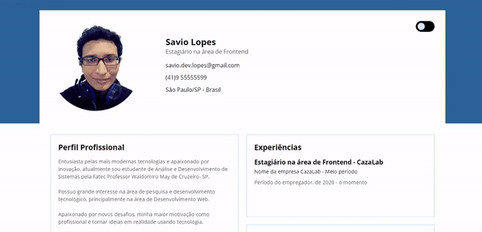

<h3 align="center">
  
</h3>

## :pushpin: Índice

- [Sobre](#sobre)
- [Layout](#layout)
- [Deploy](#deploy)
- [Tecnologias](#tecnologias)
- [Licença](#licenca)
- [Autor](#autor)
- [Agradecimentos](#agradecimento)

 

